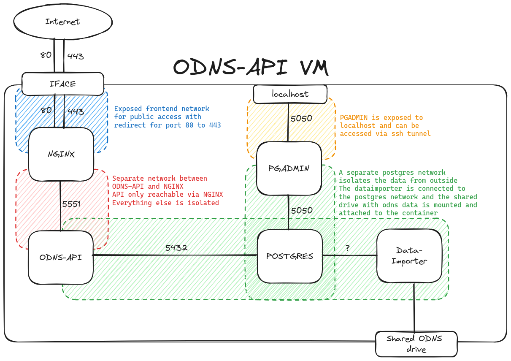

# ODNS-API Full Stack Deployment
This repository contains the full deployment stack for the ODNS-API.
This repository contains submodules (!), use

`git clone --recursive https://github.com/netd-tud/odns-api-full-stack.git`

to also clone the submodules, otherwise it won't work without further steps.

## Network Structure


## Setup
1. Clone repository
2. Rename `.env.template` into `.env` and adjust connection values
3. Rename `config.ini.template` into `config.ini` and adjust connection values
4. Run `docker compose up` or to automatically rebuild on changes `docker compose up --watch`

### Production Use
By default, nginx is configured to run locally and is accessible via localhost/127.0.0.1.
To change that, edit the `docker-compose.yml` and change the mounted volume of the nginx_web service from 

`./nginx/odnsapi.dev.conf:`

to

`./nginx/odnsapi.prod.conf:`

Finally, adjust `./nginx/odnsapi.prod.conf` to your needs.

## Teardown
There is a teardown script which you can run with

`./teardown.sh`

which also removes the postgres volume/data completely -- so be careful.
Removing that volume is necessary when adding new scripts to `postgres-init/` 
These scripts will only run once on database creation as they are mounted to `docker-entrypoint-initdb.d/`

## Latest Dataset Downloads

The importer publishes the latest TCP and UDP scans as CSV, CSV compressed with
Zstandard, and Parquet. Downloads require an API key and are available through:

`GET /api/v2/ODNSQuery/DownloadLatest?protocol=tcp&format=csv.zst`

Valid protocols are `tcp` and `udp`; valid formats are `csv`, `csv.zst`, and
`parquet`. The API authorizes the request and nginx serves the published file
from its internal download location.

### Updating an Existing Database

Postgres initialization scripts do not run again for an existing data volume.
Apply the updated query function and the idempotent indexes before deploying the
new API:

```sh
docker compose -f docker-compose.yml -f docker-compose.db.yml exec -T postgres_db sh -c 'psql -U "$POSTGRES_USER" -d "$POSTGRES_DB" -f /docker-entrypoint-initdb.d/02-create-get-dns-entries-function.sql'
docker compose -f docker-compose.yml -f docker-compose.db.yml exec -T postgres_db sh -c 'psql -U "$POSTGRES_USER" -d "$POSTGRES_DB" -f /docker-entrypoint-initdb.d/05-create-performance-indexes.sql'
```

## ToDo List
- [ ] Makefile integration
- [ ] Healthchecks for .Net app
- [ ] ?
