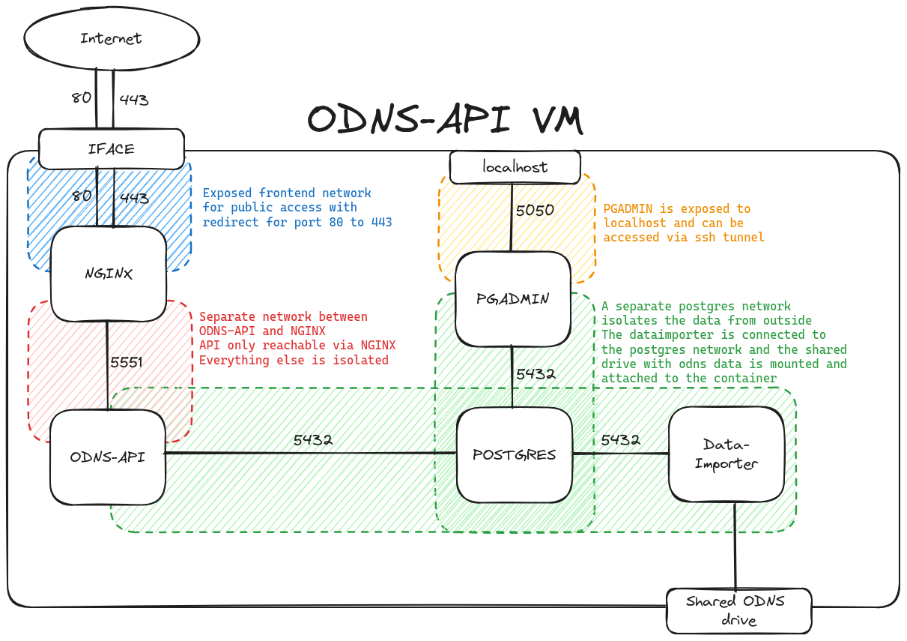

# ODNS-API Full Stack Deployment
This repository contains the full deployment stack for the ODNS-API.
This repository contains submodules (!), use

`git clone --recursive https://github.com/netd-tud/odns-api-full-stack.git`

to also clone the submodules, otherwise it won't work without further steps.

## Network Structure

## Setup
1. Clone repository
2. Rename `.env.template` into `.env` and add proper values
3. Run `sudo docker compose up`

## Teardown
There is a teardown script which you can run with

`sudo ./teardown.sh`

which also removes the postgres volume/data completely -- so be careful.
Removing that volume is necessary when adding new scripts to `postgres-init/` 
These scripts will only run once on database creation as they are mounted to `docker-entrypoint-initdb.d/`
## ToDo List
- [ ] Makefile integration
- [ ] Healthchecks for .Net app
- [ ] ?
